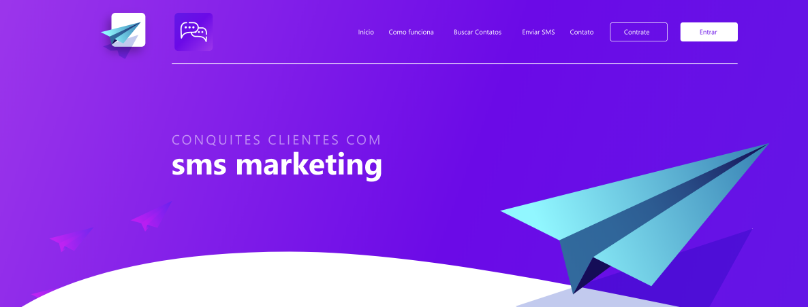

<!-- TABLE OF CONTENTS -->
# Índice
* [Sobre o Projeto](#-sobre-o-projeto)
* [Construído com](#-construído-com)
  * [Ferramentas](#ferramentas)
  * [Tecnologias](#tecnologias)
* [Começando](#-começando)
  * [Prerequisitos](#-prerequisitos)
  * [Instalação](#-instalação)
* [Utilização](#utilização)
* [Contato](#-contato)
* [Agradecimentos](#-agradecimentos)
<!-- * [Roadmap](#arrows_clockwise-roadmap) -->

<!-- ABOUT THE PROJECT -->
# Sobre o Projeto

<!-- Project image -->

  

## Clique [aqui](https://hackathon-zenvia.github.io/front-end/#) para acessar a página

## Descrição
EContacts é uma plataforma desenvolvida pela equipe 09 durante o hackathon Zenvia Experience.

A ideia do app é que o lojista utilize as suas notas fiscais das vendas geradas para encotrar o telefone de seus clientes e pode manter contato via SMS e Voz utilizando nossos serviçoes!
***

# Construído com
  ## Ferramentas
  * [VSCode](https://code.visualstudio.com/)

  ## Tecnologias
  * [Javascript](https://developer.mozilla.org/en-US/docs/Web/JavaScript)

  [Voltar ao topo](#-índice)
  ***

# Layout
Clique [aqui](https://xd.adobe.com/view/6f215767-0756-4e68-bfa5-7c259bc9279f-3a72/) para ver o layout do app no Adobe Xd.

  [Voltar ao topo](#-índice)
  ***

<!-- USAGE EXAMPLES -->
# Utilização

Para ver a desmonstração do app clique [aqui](https://youtu.be/5-cQq7JcJkA).
***

<!-- CONTACT -->
# Contato

- Ane Mendes - <ralianemc@gmail.com>
- Daniel - <daniel.keterer@gmail.com>
- Kaio Almeida - <kaioalmeidacosta@gmail.com>
- João Vitor - <j.vitor.mf@gmail.com>

[Voltar ao topo](#-índice)
***

<!-- ACKNOWLEDGEMENTS -->
# Agradecimentos

* [HackaRocket](https://zenapi.zenvia.com/zex_hackathon/)
* [Shawee](https://shawee.io/)

[Voltar ao topo](#-índice)
***
